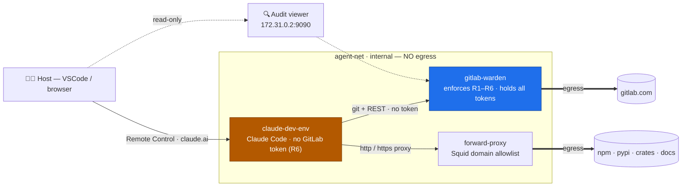

# Claudecatraz

**An autonomous Claude Code agent that may work on GitLab — under hard, non-bypassable rules.**

*No agent escapes the Warden.*

[](https://github.com/EddyXorb/claudecatraz/actions/workflows/warden-ci.yml)
[](https://github.com/EddyXorb/claudecatraz/actions/workflows/squid-ci.yml)
[](https://github.com/EddyXorb/claudecatraz/actions/workflows/compose-validate.yml)
[](https://github.com/EddyXorb/claudecatraz/actions/workflows/dockerfile-lint.yml)

---

## What it does

A dockerized, hardened environment in which an **autonomous Claude Code agent** (C++/Rust/Python toolchain) can work on GitLab projects — driven over Remote Control from claude.ai.

The point is the security model: the agent is treated as **potentially malicious**. It therefore holds **no GitLab credential whatsoever** and has **no internet route of its own**. Two purpose-built proxies sit in front of it instead:

- **Warden** — the sole holder of the GitLab tokens. It enforces rules R1–R6 on *every* git push and API call (only your own `claude/*` branches, no merge, quotas, …) and audits everything.
- **Forward proxy (Squid)** — the only way to the internet, filtered against a domain allowlist (npm, PyPI, crates, docs …). Default-deny, no TLS interception.

Even a fully compromised agent stays within policy: it cannot write to foreign branches, cannot merge anything, and can only talk to allowlisted destinations.

## Architecture



Full design, threat model and rule set: **[`docs/design/agentic-workflow/`](docs/design/agentic-workflow/README.md)**.

## Quick start

**Prerequisites:** Docker + Compose, a **dedicated** Claude sandbox account (not your primary one), and for GitLab access a service account with two tokens (see [GitLab-native setup](docs/design/agentic-workflow/01-gitlab-native.md)).

```bash
# 1. Create the bind-mount dirs (state/, logs/, …) with correct ownership
./scripts/setup-dirs.sh

# 2. Import the sandbox account's Claude credentials from the host
python3 entrypoint.py sync

# 3. Create and fill the configuration (see below)
cp .env.example .env && $EDITOR .env

# 4. Start the stack
docker compose up -d
```

The agent is then reachable over Remote Control on claude.ai. GitLab decisions can be watched live in the audit viewer (see below).

## Configuration

There are **two** configuration homes, with one source of truth per setting — no value lives in both at once:

| Where | Holds | Visibility |
| ----- | ----- | ---------- |
| **`.env`** (gitignored) | **Secrets** (Anthropic + GitLab tokens), infra (`GITLAB_URL`), and the compose profile | host only |
| **`config/warden.toml`** (version-controlled) | **Non-secret policy** — branch prefix, R5 limits, allowed projects | mounted read-only into the Warden |

```dotenv
# .env — secrets & infra
ANTHROPIC_API_KEY=                 # dedicated sandbox account, NEVER your primary one (§3.2)
GITLAB_READ_TOKEN=                 # scopes: read_api, read_repository  — only the Warden (R6)
GITLAB_WRITE_TOKEN=                # scopes: api (service account / Developer)
COMPOSE_PROFILES=warden            # enables the warden container
```

```toml
# config/warden.toml — non-secret policy (the source of truth)
branch_prefix       = "claude/"    # R2: only branches with this prefix are pushable
max_open_mrs        = 5            # R5
max_open_branches   = 10           # R5
max_writes_per_hour = 60           # R5
allowed_projects    = ["group/sub/project-a", "group/sub/project-b"]
```

> **Precedence — env overrides the file.** For each policy setting there is an optional
> `WARDEN_*` env var (`WARDEN_BRANCH_PREFIX`, `WARDEN_MAX_OPEN_MRS`,
> `WARDEN_MAX_OPEN_BRANCHES`, `WARDEN_MAX_WRITES_PER_HOUR`, `WARDEN_ALLOWED_PROJECTS`).
> Set one (non-empty) to **override** `warden.toml` for that single setting; leave it
> empty/unset to use the file. So a value is read from exactly one place at a time —
> the env var if present, otherwise the toml.

> ### ⚠️ `allowed_projects` — no wildcards
>
> Each entry must be the **full path of a concrete project** (from the namespace
> root). **Not supported:**
>
> - ❌ **Wildcards / globs / regex** — `group/*`, `group/**`, `*-ci` match nothing.
> - ❌ **Partial / leaf names** — `opt-ci` alone does not match `group/sub/opt-ci` (left-anchored).
> - ❌ **Group prefixes** — `group/sub` would even block Warden startup
>   (reconcile treats every entry as a concrete project → fail-closed).
>
> This is deliberate: an explicit, enumerable allowlist is auditable and keeps the
> read/exfiltration surface small (least privilege, design §6.10).

Toolchain versions are pinned in `.env` as well:

```dotenv
UV_VERSION=…  CLANG_VERSION=…  RUST_VERSION=…  CONAN_VERSION=…  NODE_VERSION=…
CLAUDE_CODE_VERSION=…
DEV_UID=…        # `id -u` on the host so bind mounts get the right ownership
```

Non-secret, host-editable policy (Squid allowlist, limits) lives version-controlled in
**`config/`** (mounted read-only into the containers). Runtime data (SQLite state, logs)
goes to `state/`/`logs/` (gitignored).

## Security model (R1–R6)

| #  | Rule | Enforced by |
| -- | ---- | ----------- |
| R1 | Read anything in the work scope | Read token in the Warden, GET pass-through |
| R2 | Push only to `claude/*` branches | Warden parses the git ref commands + GitLab push rules |
| R3 | MR/comment/CI only for your own branches | Warden API filter (ownership) + Developer role |
| R4 | **Never merge** | Warden blocks merge endpoints (403) + protected branches |
| R5 | Quotas (open MRs/branches, writes/h) | Warden state (SQLite, durable, fail-safe) |
| R6 | No token in the agent, network isolation | `agent-net internal` + Warden as the sole trust boundary |

Two layers: the **Warden** (primary, code) and **GitLab-native** restrictions (backstop,
zero-code). If the Warden goes down, the agent structurally has **no** route to gitlab.com
(fail-closed). Details: [threat model & design](docs/design/agentic-workflow/README.md).

## Audit log in the browser

The Warden serves a read-only web UI over **every** GitLab decision (allow/deny with rule
R1–R6, R4/R5 highlighted), filterable by channel/decision/rule/project:

**→ <http://172.31.0.2:9090/>**

- IP **`172.31.0.2`** is hard-wired in compose (`admin-net`), port **9090**.
- Reachable **from the host only**, never from the agent (separate `admin-net`, no published
  port). `localhost:9090` therefore does *not* work — use a loopback tunnel if needed:
  `socat TCP-LISTEN:9090,bind=127.0.0.1,reuseaddr,fork TCP:172.31.0.2:9090`
- Raw JSONL: <http://172.31.0.2:9090/audit> · health: <http://172.31.0.2:9090/healthz>

On the command line:

```bash
tail -f logs/warden/warden-audit.jsonl     # GitLab decisions
grep <target> logs/squid/access.log        # egress destinations
sqlite3 state/warden/state.db              # quota state
```

## Project layout

| Path | Purpose |
| ---- | ------- |
| `docker-compose.yml` | All services, networks, mounts |
| `Dockerfile` · `entrypoint.py` | Agent image (Ubuntu 24.04 + toolchain) and start logic |
| `warden/` | Policy proxy (Python/Starlette) — the trust boundary, holds all tokens |
| `forward-proxy/` | Squid image with SNI-peek allowlist egress |
| `config/` | Host-editable policy: `warden.toml`, `squid.conf`, `allowlist.txt` (mounted read-only) |
| `scripts/setup-dirs.sh` | Creates bind-mount dirs and sets ownership |
| `tests/redteam/` | End-to-end bypass attempts (red team) |
| `docs/design/agentic-workflow/` | Design, threat model, implementation plans |

## Tests

```bash
cd warden && uv run pytest          # Warden unit/integration tests
tests/redteam/test_egress.sh        # egress allowlist (red team A11)
```

CI (see badges above) checks the Warden, Squid, compose validity and the Dockerfile on every push.
